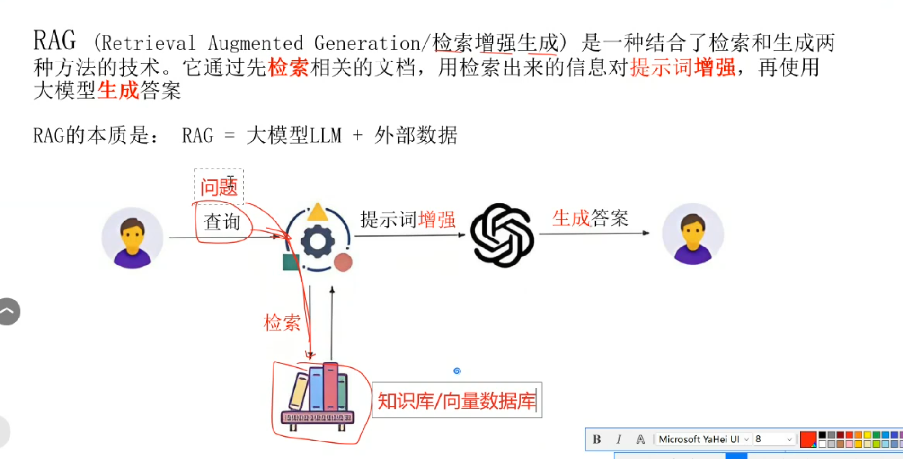
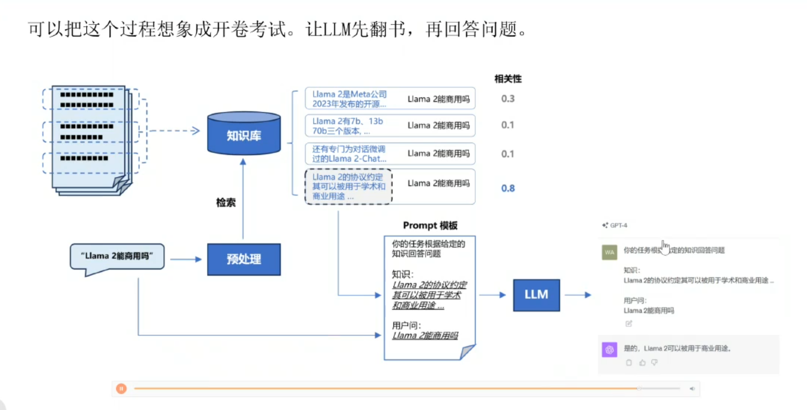
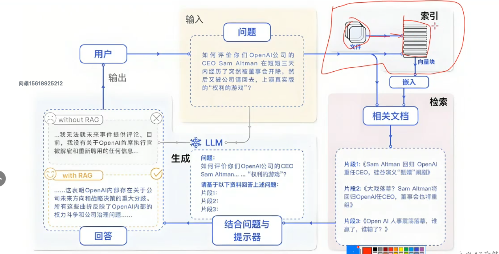

## RAG  - 检索增强生成
RAG 是一种基于向量数据库的文本处理技术，它可以帮助模型从外部数据源中检索信息，从而提高模型的知识基础。

## 为什么需要 RAG?
RAG 允许模型从外部数据源中检索信息，从而提高模型的知识基础。

RAG 的主要优点包括：
1、知识更新：RAG 可以实时更新模型的知识，而无需重新训练模型。
2、知识丰富：RAG 可以从外部数据源中检索丰富的知识，从而扩展模型的知识基础。
3、知识可解释：RAG 可以解释模型的决策过程，从而提高模型的可解释性。

### RAG 的主要缺点包括:
1、知识延迟：RAG 只能使用外部数据源中的知识，而不能实时获取最新知识。
2、知识质量：RAG 依赖外部数据源的质量，若数据源存在错误或缺失，会影响模型的知识基础。
3、知识成本：RAG 需要构建和维护向量数据库，成本较高。

### RAG 的主要步骤包括:
1、数据准备：从外部数据源中获取数据，并将其转换为向量。
2、向量数据库构建：将向量存储在向量数据库中，并建立索引。
3、向量检索：使用向量数据库进行向量检索，并返回匹配的向量。
4、生成回答：根据检索到的向量，使用模型生成回答。

### 幻觉问题
hallucination 问题：模型生成了与输入无关的答案。
解决方法： RAG 模型可以采用以下方法来避免幻觉问题：
1、增加上下文：提供更多相关的上下文信息，帮助模型生成更准确的回答。
2、过滤答案：对模型生成的答案进行过滤，排除与输入无关的内容。
3、模型训练：使用更多的真实数据和标注数据，训练模型提高其准确性。
4、模型优化：使用更好的模型架构和优化方法，提高模型的性能。
5、模型 Fine-tuning：使用更小的数据集进行微调，以适应特定的应用场景。

### 什么是 RAG 模型？
RAG 模型是一种基于向量数据库的文本处理模型，它可以从外部数据源中检索信息，从而提高模型的知识基础。

RAG 模型由以下主要组件组成：
1、向量数据库：向量数据库用于存储向量数据，并建立索引。
2、向量嵌入模型：向量嵌入模型将原始数据转换为向量表示。
3、向量检索模型：向量检索模型根据输入向量，从向量数据库中检索匹配的向量。
4、生成回答模型：生成回答模型根据检索到的向量，生成回答.

### 构建 RAG 的流程

### 什么是微调
微调（Fine-tuning）是一种模型训练方法，它可以根据特定的应用场景来调整模型参数，从而提高模型的性能。改变模型本身的能力，使其适应特定的应用场景。

微调的步骤包括：
1、数据准备：从外部数据源中获取数据，并将其转换为向量。
2、模型训练：使用训练数据对模型进行训练，并保存模型参数。
3、模型微调：使用微调数据对模型进行微调，并保存模型参数。
4、模型评估：使用评估数据对模型进行评估，并保存模型参数。
5、模型部署：将模型部署到生产环境，并使用模型生成回答。

### 通过 FastGPT 构建 RAG 模型
FastGPT 是一个基于 GPT-3.5 模型的 RAG 模型，它可以从外部数据源中检索信息，从而提高模型的知识基础。

PDF: 增强检索

### RAG 系统工作流程

#### Naive RAG

Navive RAG 主要有 3 个步骤:

1、索引化: 文档 => 分块 => 向量化 => 存储

文档加载与分块:
分块策略:
1、按照字符数来切分
2、按照固定字符数 结合 overlapping window
3、按照句子来切分
4、递归方法：将文档递归地切分，直到满足最小分块大小.

#### Advanced RAG 
什么意思：
1、增加上下文：提供更多相关的上下文信息，帮助模型生成更准确的回答。
2、过滤答案：对模型生成的答案进行过滤，排除与输入无关的内容。
3、模型训练：使用更多的真实数据和标注数据，训练模型提高其准确性。
4、模型优化：使用更好的模型架构和优化方法，提高模型的性能。
5、模型 Fine-tuning：使用更小的数据集进行微调，以适应特定的应用场景。

