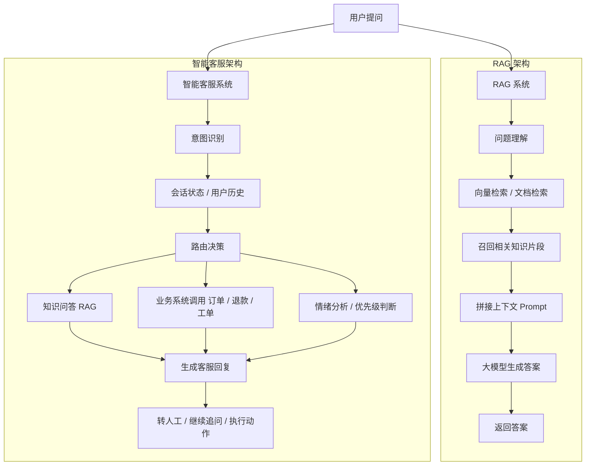
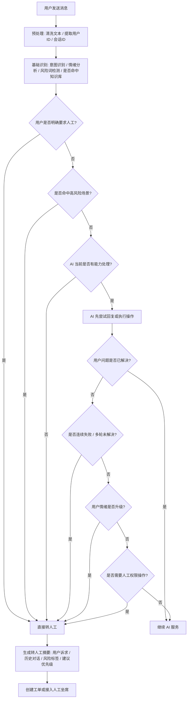

# 智能客服系统学习笔记

## 1. RAG 和智能客服有本质区别吗？

有区别，而且两者不在同一个层级。

- `RAG` 是一种技术方案
- `智能客服` 是一种业务场景或产品系统

可以这样理解：

```text
RAG 可以是智能客服的一部分
但智能客服不等于 RAG
```

### 1.1 RAG 的核心目标

RAG（Retrieval-Augmented Generation，检索增强生成）主要解决：

- 大模型不知道企业私有知识
- 大模型容易出现幻觉

它的核心流程是：

```text
用户问题
-> 检索相关知识
-> 将检索结果拼进上下文
-> 大模型基于上下文回答
```

RAG 更关注：

- 知识召回
- 文档相关性
- 回答是否有依据
- 如何降低幻觉

### 1.2 智能客服的核心目标

智能客服解决的是更完整的服务问题，比如：

- 回答常见问题
- 处理订单咨询
- 识别用户情绪
- 判断问题分类
- 记住上下文
- 调用业务系统
- 转人工
- 处理投诉、退款、催单等场景

它关注的是：

- 用户体验
- 多轮会话
- 业务流程
- 系统集成
- 服务质量和稳定性

### 1.3 一句话区分

```text
RAG 解决“怎么拿到知识并回答”
智能客服解决“怎么把用户问题真正处理完”
```

---

## 2. RAG 系统架构 vs 智能客服系统架构



### 2.1 图中的关键信息

RAG 的重点是：

```text
检索 -> 上下文增强 -> 回答
```

智能客服的重点是：

```text
理解问题 -> 选择处理路径 -> 调知识/调系统/结合上下文 -> 完成服务
```

### 2.2 两者的关系

最实用的记法：

```text
智能客服 = 对话系统 + 业务流程 + 可能包含 RAG
```

也就是说：

- RAG 往往是智能客服中的“知识问答模块”
- 智能客服除了 RAG，还会有记忆、业务接口、风险控制、转人工等能力

---

## 3. 智能客服什么时候应该转人工？

通常不是让大模型“自由决定”，而是：

```text
规则 + 模型判断 + 业务信号
```

一起决定。

### 3.1 常见触发条件

#### 3.1.1 用户明确要求人工

例如：

- 我要人工客服
- 帮我转真人
- 不要机器人回复

这类情况通常直接转人工。

#### 3.1.2 AI 不确定或无法处理

例如：

- 检索不到相关知识
- 意图识别置信度很低
- 连续多轮没有解决问题
- 回答反复失败

#### 3.1.3 高风险 / 高敏感问题

例如：

- 投诉
- 赔偿
- 支付异常
- 账号安全
- 法律、隐私、合规问题

#### 3.1.4 用户情绪强烈

例如：

- 明显愤怒
- 连续抱怨
- 威胁投诉、差评、曝光

#### 3.1.5 需要人工权限或审批

例如：

- 特殊退款
- 人工补偿
- 订单修改
- 例外流程处理

### 3.2 一个典型判断逻辑

```text
满足任意一个条件就转人工：
1. 用户明确要求人工
2. 命中投诉/赔偿/法律/账号安全类意图
3. 情绪等级 = 高风险
4. 连续2次回答后用户仍表示“没解决”
5. 知识库命中率过低或置信度过低
6. 需要人工审批动作
```

### 3.3 更合理的系统设计

不要完全交给模型拍板，推荐模式是：

```text
AI 提供判断信号
规则引擎做最终决策
```

例如：

- AI 负责识别情绪、意图、是否已解决
- 系统根据规则决定是否 `handoff_to_human = true`

---

## 4. 智能客服转人工判定流程图



### 4.1 这个流程图表达的核心思想

转人工不是一次性的单点判断，而是一个升级策略。

推荐的判断顺序：

1. 先看用户是否主动要求人工
2. 再看是否命中高风险问题
3. 再判断 AI 是否真的有能力处理
4. 如果 AI 已尝试处理，再检查是否多轮失败、情绪升级、需要人工权限

---

## 5. 最小 RAG 系统需要哪些模块

最小 RAG 的目标是：

```text
让模型基于外部知识回答问题
```

最小版一般包含 5 个模块：

### 5.1 文档输入模块

作用：

- 读取知识来源

常见来源：

- PDF
- 网页
- Markdown
- Word
- 本地文本

### 5.2 文档切分模块

作用：

- 将长文档切成适合检索的小块

### 5.3 向量化 + 向量库存储

作用：

- 把文本转成向量
- 支持相似度检索

最小实现常见选择：

- FAISS
- Chroma

### 5.4 检索模块

作用：

- 用户提问后，从知识库召回最相关的内容

最小实现：

- Top-K 相似度检索

### 5.5 生成模块

作用：

- 把用户问题和检索结果交给大模型生成答案

最小 RAG 架构：

```text
文档 -> 切分 -> 向量化 -> 向量库
用户问题 -> 检索 -> 上下文拼接 -> LLM -> 回答
```

---

## 6. 最小智能客服系统需要哪些模块

最小智能客服的目标是：

```text
真正处理用户咨询或服务请求
```

最小版建议至少包含 6 个模块。

### 6.1 会话输入模块

作用：

- 接收用户消息
- 带上用户标识和会话 ID

### 6.2 对话状态 / 记忆模块

作用：

- 记住上下文
- 让系统知道当前轮不是孤立问题

常见最小实现：

- `ChatMessageHistory`
- Redis 会话历史

### 6.3 意图识别模块

作用：

- 判断当前请求属于什么类型

例如：

- 知识咨询
- 订单查询
- 退款投诉
- 人工请求
- 闲聊

### 6.4 路由模块

作用：

- 根据意图选择处理路径

例如：

- 知识问题 -> RAG
- 订单问题 -> 调订单系统
- 投诉问题 -> 风险评估 / 转人工
- 闲聊 -> 普通对话链

### 6.5 回复生成模块

作用：

- 根据处理结果生成客服回复

回复需要结合：

- 用户原话
- 当前处理结果
- 业务语气
- 服务规范

### 6.6 转人工 / 兜底模块

作用：

- AI 无法处理时升级
- 高风险场景兜底
- 连续失败时交人工

最小智能客服系统架构：

```text
用户消息
-> 会话管理
-> 意图识别
-> 路由分发
   -> 知识问答（RAG）
   -> 业务接口调用
   -> 风险判断
-> 生成客服回复
-> 必要时转人工
```

---

## 7. 最小 RAG 和最小智能客服的核心区别

最小 RAG 重点在：

- 文档
- 检索
- 回答依据

最小智能客服重点在：

- 会话
- 意图
- 路由
- 服务流程
- 转人工兜底

一句话总结：

```text
最小 RAG = 知识问答闭环
最小智能客服 = 服务处理闭环
```

---

## 8. 项目落地时应该先搭什么

### 8.1 如果需求主要是“回答知识类问题”

先做最小 RAG：

- 文档加载
- 文档切分
- 向量库
- 检索
- 基于上下文回答

### 8.2 如果需求主要是“处理用户服务请求”

先做最小智能客服：

- 会话管理
- 意图分类
- 路由
- 回复生成
- 转人工机制

### 8.3 如果是企业客服场景

最推荐的路径是：

```text
先搭最小智能客服骨架
再把 RAG 作为知识问答模块接进去
```

原因：

- 企业客服不仅要回答知识，还要处理订单、退款、投诉、工单等流程
- 只做一个 RAG Demo，不足以支撑完整客服系统

---

## 9. 一页总结

### 9.1 RAG 是什么

- 一种让模型基于外部知识回答问题的技术方案

### 9.2 智能客服是什么

- 一个完整的服务型系统，可能包含 RAG、记忆、路由、业务接口和转人工机制

### 9.3 两者关系

```text
RAG 是能力模块
智能客服是业务系统
```

### 9.4 转人工怎么做

```text
业务规则决定底线
AI 提供判断依据
系统做最终升级决策
```

### 9.5 落地建议

```text
做企业客服时，优先搭“智能客服骨架”，再接入 RAG
```

